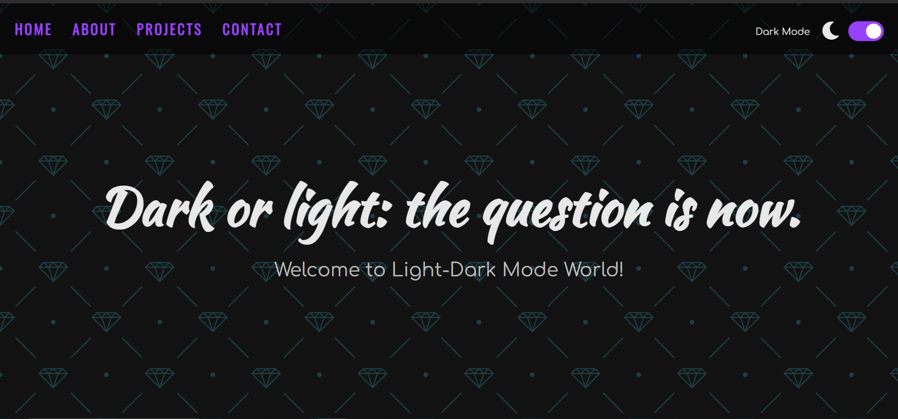

# Light/Dark Mode App

## Illuminate Your Experience: Introducing Light/Dark Mode App!

You can check it out [here]( ).

## Author

👤 **Duško Vokić**

* LinkedIn: [Here](https://linkedin.com/in/duško-vokić-0337a2106)
* GitHub: [@D-vokic](https://github.com/D-vokic)

Light/Dark Mode App revolutionizes your digital experience by offering the flexibility to switch seamlessly between light and dark themes. Whether you prefer a soothing dark interface for nighttime browsing or a crisp light background during the day, this app allows you to customize your viewing experience effortlessly. Enjoy reduced eye strain in low-light environments and adapt to varying lighting conditions with ease. Enhance readability and aesthetic appeal while maintaining control over your device's display. Light/Dark Mode App ensures your interface suits your preferences, anytime, anywhere.

## Additional Details
1. **Customization Options:** Light/Dark Mode Apps often offer customization options beyond just toggling between light and dark themes. Users may have the ability to adjust the brightness levels, color schemes, and even schedule automatic switches between modes based on time of day.
2. **Eye Strain Reduction:** One of the primary benefits of Dark Mode is its potential to reduce eye strain, particularly in low-light conditions. The darker background with lighter text can be easier on the eyes, especially during prolonged periods of device usage.
3. **Battery Conservation:** In OLED and AMOLED screens, Dark Mode can contribute to battery conservation. Since black pixels on these screens are essentially turned off, using a dark theme can help save battery life compared to bright themes, which require more power to display.
4. **Operating System Integration:** Many operating systems, including iOS, Android, and Windows, have integrated Light/Dark Mode settings at the system level. This means that not only individual apps but also system interfaces and menus can adapt to the user's preferred mode.
5. **Developer Implementation:** Developers must consider implementing Light/Dark Mode effectively into their applications to ensure consistency, usability, and accessibility across different devices and platforms. This involves careful consideration of color contrasts, readability, and user interface elements in both light and dark themes.
6. **User Preference:** The choice between light and dark themes often comes down to personal preference. While some users may prefer the sleek, modern look of Dark Mode, others may find Light Mode more comfortable for extended reading or tasks requiring high visual acuity.
7. **Accessibility Features:** Light/Dark Mode Apps often include accessibility features that cater to users with visual impairments or sensitivity to light. These features may include options for increased contrast, larger fonts, or alternative color schemes to improve readability for all users.

Overall, Light/Dark Mode Apps aim to provide users with a more customizable and comfortable digital experience, catering to individual preferences and promoting usability in various lighting conditions.

### Overview
Light/Dark Mode Apps offer users the ability to switch between light and dark themes, adapting the display to varying lighting conditions and personal preferences. They reduce eye strain, conserve battery life on certain screen types, and often include accessibility features to enhance readability for all users.

### Key Features
1. **Customizable Themes:** Light/Dark Mode Apps allow users to switch between light and dark themes, and sometimes offer additional customization options such as adjusting brightness levels and color schemes.
2. **Eye Strain Reduction:** Dark Mode helps reduce eye strain, particularly in low-light conditions, by providing a darker background with lighter text, which can be easier on the eyes during prolonged device usage.
3. **Battery Conservation:** In OLED and AMOLED screens, Dark Mode can contribute to battery conservation by turning off black pixels, thus consuming less power compared to bright themes, which require more energy to display.

### Usage
TWelcome to the Light/Dark Mode App! This guide will walk you through the steps to effectively use the app's features and customize your viewing experience.
Getting Started:
1. **Download and Installation:**
> Clone or download the Light/Dark Mode App repository from GitHub to your local machine.
2. **Setting Up the Environment:**
> Ensure you have the necessary dependencies installed, such as Xcode for iOS apps or Android Studio for Android apps.
Usage Instructions:
1. **Launching the App:**
> Open the project in your preferred IDE.
> Build and run the project on your emulator or physical device.
2. **Navigating the Interface:**
> Familiarize yourself with the app's user interface, including navigation menus, buttons, and settings options.
3. **Toggling Between Light and Dark Modes:**
> Look for the option to switch between light and dark themes.
> Tap or toggle the switch to activate your preferred mode.
Troubleshooting:
1. **Common Issues and Solutions:**
> If you encounter any issues during installation or usage, refer to the troubleshooting section in the README.md file of the GitHub repository.
> Search for existing GitHub issues or open a new one to report bugs or request assistance from the developer community.
Conclusion:
Congratulations! You have successfully learned how to use the Light/Dark Mode App. Enjoy the flexibility and comfort of customizing your digital experience according to your preferences and lighting conditions.

Feel free to provide feedback, suggestions, or contribute to the project on GitHub to help improve the app for all users.

### Benefits
Light/Dark Mode Apps reduce eye strain by minimizing blue light exposure, enhance readability with higher text contrast, and conserve battery life on OLED/AMOLED screens. They offer customizable themes for personalized experiences, making content more accessible to users with visual impairments. Additionally, the sleek aesthetic of Dark Mode enhances user satisfaction and creates a modern interface design.

### Implementing Light/Dark Mode in Your Frontend Application: A Guide for GitHub Users
The application is implemented using HTML, CSS, and JavaScript to enable its functionality within a web browser. Here's a brief overview of the implementation:

**Introduction:**
As frontend developers, we strive to enhance user experience and accessibility in our applications. One effective way to achieve this is by implementing Light/Dark Mode functionality, which allows users to customize their viewing experience based on preference and lighting conditions.

**Why Implement Light/Dark Mode?**
1. **Enhanced User Comfort:** Light/Dark Mode offers users the flexibility to choose a theme that suits their visual comfort, reducing eye strain and improving readability, particularly in low-light environments.
2. **Improved Accessibility:** Dark Mode can enhance accessibility for users with visual impairments or sensitivity to bright light, making content more readable and accessible to a wider audience.
3. Modern Aesthetic: Integrating Light/Dark Mode can elevate the aesthetic appeal of your frontend application, providing users with a sleek and modern interface design that enhances overall satisfaction.

**How to Implement Light/Dark Mode:**
1. **CSS Variables and Media Queries:** Utilize CSS variables and media queries to define color schemes and styles for both light and dark themes. This allows for easy switching between themes based on user preference or system settings.
2. **JavaScript and Theme Toggle:** Implement JavaScript to add functionality for toggling between light and dark themes. This may involve adding event listeners to buttons or switches that trigger theme changes dynamically.
3. **Storage and Persistence:** Consider using local storage or cookies to store user preferences for Light/Dark Mode, ensuring that their chosen theme persists across sessions and visits to your application.

### Integration
For GitHub users, especially frontend developers, integrating Light/Dark Mode functionality into applications offers enhanced user experience and accessibility. Frontend developers can leverage CSS variables or preprocessors like Sass to define theme-specific stylesheets and seamlessly switch between light and dark themes. Additionally, they can utilize JavaScript frameworks like React or Vue.js to dynamically update the UI based on user preferences or system settings, ensuring a smooth and responsive transition between modes. With proper documentation and version control through GitHub, developers can collaborate effectively and iteratively improve the Light/Dark Mode integration to meet user needs and preferences.

### Conclusion
Incorporating Light/Dark Mode functionality into your frontend applications not only enhances user experience and accessibility but also showcases your commitment to providing a modern and customizable interface. By following these implementation strategies, you can empower users to tailor their viewing experience while improving engagement and satisfaction with your application.

Remember to document your implementation process and encourage collaboration and feedback from the GitHub community to further enhance the usability and effectiveness of Light/Dark Mode in your frontend projects.

## Technologies and Languages

- HTML5
- CSS3
- JavaScript

## License

This project is licensed under the [MIT License](https://www.mit.edu/~amini/LICENSE.md).

## Contact Information

You can contact me via email: vokic.dusko@gmail.com
